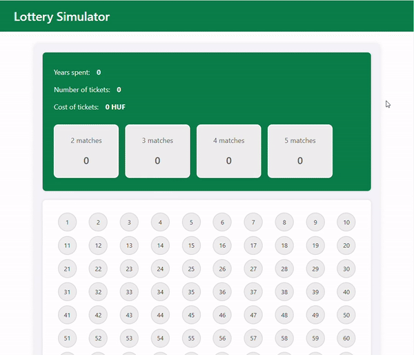

# Lottery Simulator

A web application that allows users to store lottery tickets, draw numbers, and display the results of matches.

## Features

- **Number Drawing**: Randomly draws numbers from a given range.
- **Ticket Storage**: Saves lottery tickets submitted by users.
- **Results Generation**: Conducts lottery draws and stores the results.
- **Game Reset**: Clears all data and restarts the game.
- **Statistics Display**: Shows statistical data of the game results.

## Installation

### Prerequisites

- PHP 8.0 or newer
- Composer
- MySQL or another compatible database

### Installation Steps

1. **Clone the repository:**

    ```bash
    git clone https://github.com/kittii9797/lottery-simulator.git
    ```

2. **Navigate to the project directory:**

    ```bash
    cd lottery-simulator
    ```

3. **Install the project dependencies:**

    ```bash
    composer install
    ```

4. **Copy the `.env.example` file to `.env`:**

    ```bash
    cp .env.example .env
    ```

5. **Generate a new application key:**

    ```bash
    php artisan key:generate
    ```

6. **Configure your database settings in the `.env` file.**

7. **Run the migrations:**

    ```bash
    php artisan migrate
    ```

8. **Start the Laravel built-in server:**

    ```bash
    php artisan serve
    ```

    The application is now available at `http://localhost:8000`.

## API Endpoints

- `GET /api/draw` - Draws random numbers
- `POST /api/tickets` - Stores lottery tickets
- `POST /api/results` - Generates results
- `POST /api/reset` - Resets the game
- `GET /api/last-result` - Retrieves the last drawn numbers
- `GET /api/statistics` - Retrieves statistics

## User Interface

The project uses Vue.js for the frontend. The user interface includes:

- Options to select numbers
- Submit tickets
- View results
- Restart the game and view statistics

## Preview



